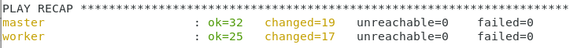
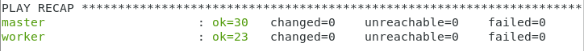

# Ansible-Lab/Day2(Roles)

## Aliaksei Tsyuliou

# Inventory file
```
	[all:children]
	masters
	workers

	[masters]
	master ansible_host=192.168.56.22 

	[workers]
	worker ansible_host=192.168.56.21 

	[all:vars]
	ansible_connection=paramiko
	ansible_user=root
	ansible_ssh_pass=vagrant	
```

# Playbook.yml
```
- hosts: all
  become: yes
  pre_tasks:
    - name: Create /etc/ansible/facts.d
      file:
        path: /etc/ansible/facts.d
        state: directory

- name: common feature / installation kubernetes
  hosts: all
  roles:   
    - common    
    - k8s-base

- name: init cluster
  hosts: master
  roles:
    - k8s-master    

- name: join worker node
  hosts: worker
  roles: 
    - k8s-worker    

- hosts: master
  become: yes  
  post_tasks:
    - name: add worker status for node
      shell: kubectl label node worker-node node-role.kubernetes.io/worker=worker
      register: output     
      failed_when: "'Failed' in output.stdout"
      changed_when: no
```

### Provision results:
**1st provision:**



**2nd provision:**

